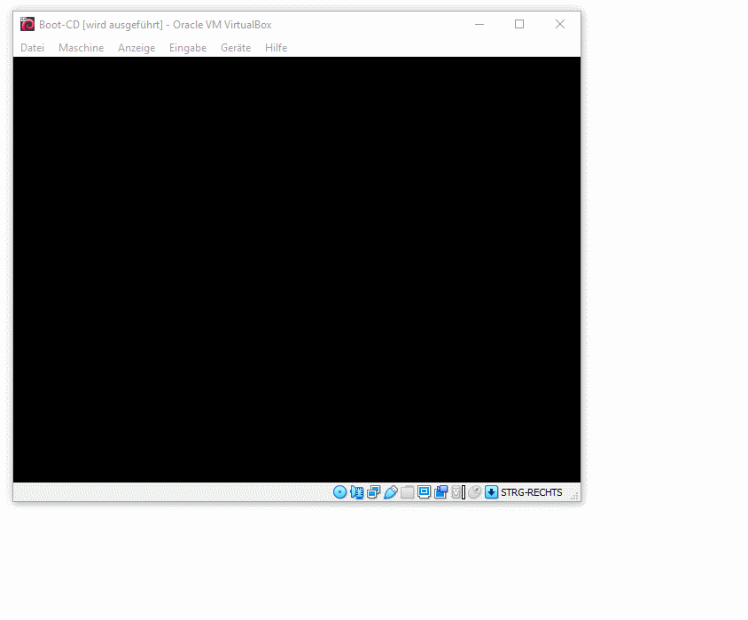

<h1>Browser Box</h1>

A lightweight GNU/Linux Debian installation just for browsing.

<h2>What is the Browser Box?</h2>

I wanted a browser in a virtual machine that is read-only. I started with a minimal <a href="https://www.debian.org/">Debian</a> net installation, added <a href="https://www.xfce.org/">XFCE</a>, Breeze icon/cursor theme, ARC-theme and installed <a href="https://www.chromium.org/">Chromium</a> as a browser. Then I used the <a href="https://www.linux-live.org/">Linux Live Kit</a> to build a tiny ISO image out of the installation. My current Browser Box just requires 485 MB for the English version, the German localization takes around 504 MB in size. Both including <a href="https://www.virtualbox.org/">Virtual Box</a>'s Guest Additions for more convenience in my VM environment.

<h2>What is Browser Box good for?</h2>

My Browser Box helps me to surf without leaving permanent cookies and other tracking stuff. I feel safer when surfing the Web knowing that nothing is permanently stored onto my working PC. Having a ISO read-only file system and using a VM also provides additional security. If you do research on malware as I do, or analyze suspicious URLs and other malicious content, a virtualized GNU/Linux can be very handy. You could also use the Browser Box as some kind of Kiosk System (Hotel Lobby, School, Training Facilities, etc). It is easy to deploy and handle. You can also add specific software as you need. It is a great tool to deploy for demos, workshops and online trainings.

<h2>Building your own Browser Box</h2>

The process to build such a live ISO is straight forward. In the following section I will provide a step-by-step guide, so you can build your own Browser Box. If you do not want to build it by your own you can download one of my builds below.

<h3>Start with the Debian Net Installer</h3>

Boot the "Debian Net Installer" ISO from you favorite hypervisor. I use Virtual Box and have included basic VDI/VBOX here. 
From the Installer Menu select "Advanced options"->"Expert install". 
Now follow the installation

<ul>
  <li>choose your preferred language</li>
  <li>configure your local keyboard layout</li>
  <li>configure network (use defaults)</li>
  <li>select the repository (I use http)</li>
  <li>enabled module "usb-storage (USB storage)</li>
  <li>do not install anything from "Load installer components from CD"</li>
  <li>Set hostname to debian-browser-box</li>
  <li>Do not set domain name</li>
  <li>enabled shadow passwords</li>
  <li>Do not allow root to login</li>
  <li>User's full name is Browser Box, username is browserbox</li>
  <li>NTP clock configuration set</li>
  <li>Disk Partition: use entire disk, all files in one partition</li>
  <li>Install the base system</li>
  <li>If asked to install X11 Virtual Box special drivers: don't!</li>
  <li>Kernel to install: linux-image-amd64</li>
  <li>installed generic drivers: include all available drivers</li>
  <li>Configured the package manager with default mirror, do not install non-free software, do not install contrib software</li>
  <li>Enable source repositories in APT</li>
  <li>Services to use: security updates release updates</li>
  <li>Do not configure discover: "No automatic updates"</li>
  <li>Do nut participate in the package usage survey</li>
  <li>Do not install any software from "Software selection". Unselect "Debain desktop envrionment", "print server" and "standard system utilities"</li>
  <li>Install GRUB to the master boot record</li>
  <li>Do not forcte GRUB installation to the EFI removable media path</li>
  <li>Finish the installation</li>
</ul>

<h3>Setup your freshly installed Debian Browser Box</h3>

Boot up the freshly installed Debian system. Log into the box. Follow the steps in the exact order or you may risk a function and tiny installation.

<pre>
sudo ln -s /dev/null /etc/udev/rules.d/70-persistent-net.rules
sudo udevadm trigger
sudo apt-get install --no-install-recommends wget p7zip-full ca-certificates
sudo apt-get install --no-install-recommends squashfs-tools aufs-dkms genisoimage
sudo apt-get install --no-install-recommends build-essential module-assistant
sudo m-a prepare
sudo apt-get install --no-install-recommends xorg xfce4 breeze-icon-theme breeze-cursor-theme xfce4-terminal xfce4-screenshooter mousepad gnome-calculator
sudo apt-get install --no-install-recommends pulseaudio gstreamer1.0-pulseaudio pavucontrol
sudo apt-get install --no-install-recommends fonts-arkpandora fonts-liberation
sudo fc-cache -f
sudo apt-get install --no-install-recommends arc-theme
sudo apt-get install thunar-volman gvfs
systemctl set-default multi-user.target
sudo mkdir /etc/systemd/system/getty@tty1.service.d
sudo nano /etc/systemd/system/getty@tty1.service.d/override.conf
</pre>

Now add the following into the override.conf file. Please note: If you have not chosen the user "browserbox" as default user, you SHALL use your specific username instead of browserbox below:

<pre>
[Service]
ExecStart=
ExecStart=-/sbin/agetty --autologin browserbox --noclear %I $TERM
Type=idle
</pre>

Open up .bashrc (nano .bashrc) and add

<pre>
if [ -z $DISPLAY ] && [ $(tty) = /dev/tty1 ]; then
  exec startx
fi
</pre>

Now you can configure the desktop, install additional software like a Web Browser.

<h2>Download my latest build</h2>

You can download my latest build here

<ul>
  <li><a href="https://bitnuts.de/browserbox/linux-x86_64_en.iso">Debian Browser Box (ISO) (EN) [2020-10-17]</a></li>
  <li><a href="https://bitnuts.de/browserbox/linux-x86_64_de.iso">Debian Browser Box (ISO) (DE) [2020-10-17]</a></li>
</ul>

<h3>Disclaimer</h3>

This Browser Box and its components are provided “as is”. You bear the risk of use. We do not express any warranties, representations or conditions. You may not claim any direct or other damages, including consequential damages, lost profits, special, indirect or incidental damages. Consider yourself warned and informed.

<h2>Need help?</h2>
Just contact me via e-mail hazelfazel @ bitnuts.de
